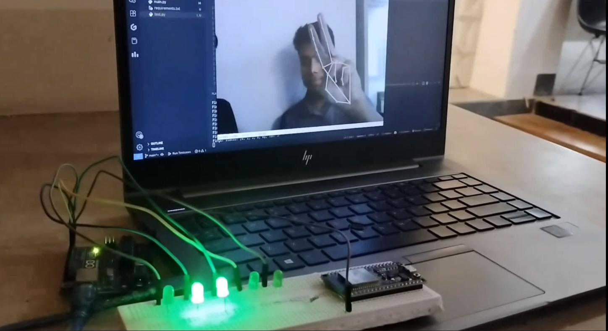

# GLimo ✋🔌 
## Gesture-Controlled LED Control Using OpenCV, MediaPipe, and Arduino

GLimo (Gesture-LED Interface Model) is a Python-based project that detects hand gestures using **OpenCV** and **MediaPipe**, then uses the position of raised fingers to control corresponding LEDs connected to an **Arduino UNO** via **PyFirmata**.

---

## 🧠 How It Works

GLimo uses **real-time hand tracking** to detect which fingers are up. Each finger corresponds to one LED connected to the Arduino UNO. If a finger is up, the LED in the same position lights up!

- 🖐️ Index finger up → LED 1 ON  
- ✌️ Index + Middle fingers up → LED 1 & 2 ON  
- 🤟 Index + Middle + Pinky → LED 1, 2 & 5 ON  
- And so on...

This makes for a super intuitive LED control system just by moving your hand in front of the camera!

---

## 📸 Demo

Image:


Video:
<video src="./demo.mp4" controls width="600"></video>


---

## 🧰 Tech Stack

### Software:
- **Python 3**
- **OpenCV** – for camera input and image processing
- **MediaPipe** – for hand landmark detection
- **PyFirmata** – for communicating with the Arduino board via serial

### Hardware:
- **Arduino UNO**
- **LEDs (5x or more)**
- **USB cable** – for serial connection
- **Resistors (220Ω recommended)** – for current limiting
- **Breadboard + jumper wires**

---

## 🚀 Setup & Usage

### 0. Create a Virtual Environment
```bash
// linux or mac
python3 -m venv .venv
source .venv/bin/activate
```

### 1. Install Dependencies

```bash
pip install opencv-python mediapipe pyfirmata
```

### 2. Upload Firmata to Arduino

Open Arduino IDE and upload the StandardFirmata example: 

`File > Examples > Firmata > StandardFirmata`

Then select your board and port, and upload it.

### 3. Connect LEDs to Arduino

Use digital pins 2–6 (or as set in your code) for LEDs.
Connect each LED through a 220Ω resistor to ground.

### 4. Run the Python Script

```bash
python glimo.py
```

Make sure your hand is visible in the webcam. The LEDs will turn on/off based on which fingers are up.

### 🔧 Customization

You can:

    Map other gestures to LEDs

    Add support for multiple hand gestures or multiple users

    Use PWM pins to control LED brightness